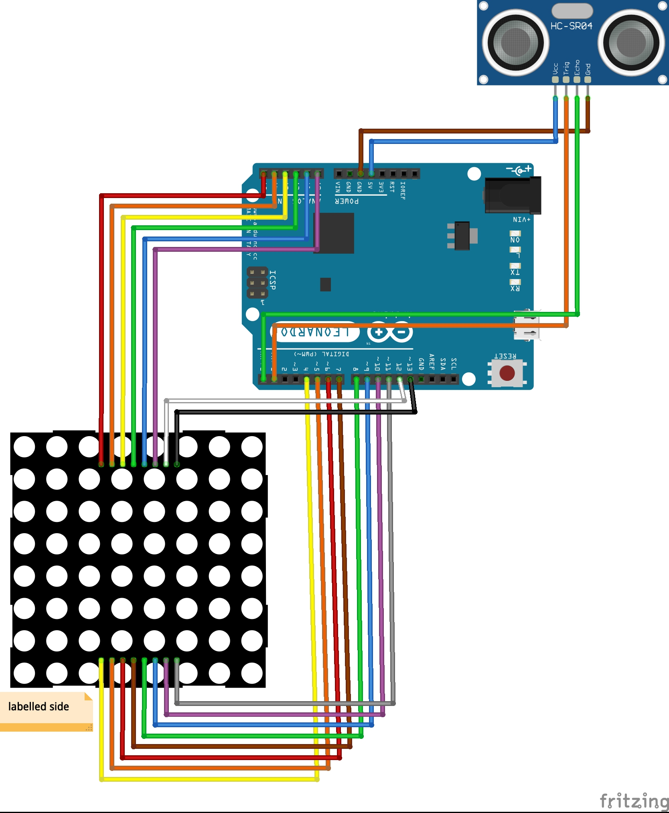

# toilet-sensor
An Arduino-based toilet cistern monitor.

## Idea
Sometimes the toilet needs an extra flush, and the cistern takes a while to fill up. How full is it? How long should I wait? 

These are important questions.

Finally, we have an answer.

## Materials required
Electronics:
* 1 Arduino
* 1 8x8 LED matrix
* 1 HC-SR04 Ultrasonic distance sensor
* Ribbon cable
* Jumper pin connectors
* 1 Ethernet cable
* 1 Mini breadboard
* 1 USB power supply

Other:
* 1 Small plastic box
* Double-sided sticky tape
* Cardboard
* Small screws
* Drill and assorted bits
* Various small pliers, screwdriver, common tools

## Construction

## Installation

## Code
See the full Arduino C++ code in [toilet-sensor.ino](toilet-sensor.ino). 

## Circuit

## Calibration
Once the sensor and display are installed, the readings must be calibrated, since we don't know exactly how high or low the water level will be in comparison to our test runs. This can be done very easily by capturing the serial output of the Arduino and exporting it to a spreadsheet.

Due to the confined space within the cistern and the natural movement of the water as it refills, the data at the start and end of the refill cycle is quite noisy. Ideally this would be solved by taking higher frequency measurements and smoothing for an average value, but this can come later.

For simplicity we can take this example and take the `top` value as `400` and the `bottom` value as `1900`. These values are configured at the top of the code file.

## References
These tutorials and guides proved useful during the project

* [Programming 8x8 LED Matrix](https://create.arduino.cc/projecthub/SAnwandter1/programming-8x8-led-matrix-23475a)
* [Simple Arduino and HC-SR04 Example](https://www.instructables.com/id/Simple-Arduino-and-HC-SR04-Example/)
